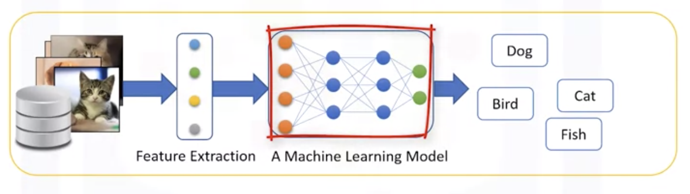

##  Machine Learning(ML) là gì

Machine learning là lĩnh vực của khoa học máy tính mang lại cho " máy tính khả năng để học mà không được lập trình rõ ràng." 

Vậy "không được lập trình rõ ràng" là gì?

Giả sử rằng bạn có bộ dữ liệu hình ảnh của động vật như mèo và chó, và bạn muốn có phần mềm hoặc ứng dụng có thể nhận biết và phân biệt chúng. Điều đầu tiên mà bạn phải làm ở đây là diễn giải các hình ảnh dưới dạng một tập hợp các tính năng. Ví dụ, hình ảnh có cho thấy đôi mắt của con vật không? Nếu vậy, kích thước của chúng là gì? Nó có tai không? Một cái đuôi thì sao? Có bao nhiêu chân? Nó có cánh không? 

Trước khi có machine learning, mỗi hình ảnh sẽ được chuyển thành một vectơ các tính năng. Sau đó, theo cách truyền thống, chúng ta phải viết ra một số quy tắc hoặc phương thức để máy tính trở lên thông minh và phát hiện các động vật. 

Nhưng, nó thất bại. Tại sao? 

Vâng, như bạn có thể đoán, nó cần rất nhiều quy tắc, phụ thuộc nhiều vào bộ dữ liệu hiện tại, và không đủ khái quát để phát hiện các trường hợp ngoài tập mẫu. 

Đây là khi machine learning xuất hiện. 

Sử dụng machine learning, cho phép chúng ta xây dựng một mô hình xem xét tất cả các bộ tính năng, và loại động vật tương ứng, nó sẽ học mô hình của từng con vật. Các mô hình được xây dựng bởi các thuật toán machine learning. Nó phát hiện mà không được lập trình rõ ràng để làm như vậy. 

Về bản chất, machine learning tuân theo quy trình tương tự mà một đứa trẻ 4 tuổi sử dụng để học, hiểu và phân biệt động vật. Vì vậy, các thuật toán machine learning, lấy cảm hứng từ quá trình học tập của con người, lặp đi lặp lại việc học từ dữ liệu và cho phép máy tính tìm ra điểm giống nhau giữa các đối tượng. Các mô hình này giúp chúng ta trong một loạt các nhiệm vụ, chẳng hạn như nhận dạng đối tượng, tóm tắt, đề nghị, v.v.

## Sự khác nhau giữa AI, ML và Deep Learning(DL)

**AI** cố gắng làm cho máy tính trở nên thông minh bằng cách bắt chước các **chức năng nhận thức** của con người

AI components:

- Computer Vision
- Language Processing
- Creativity (Sáng tạo)
- Summarization (Tóm tắt)

**Machine Learning** là một nhánh của AI tính toán dựa trên số liệu thống kê. Nó  dạy máy tính giải quyết vấn đề bằng cách xem xét hàng trăm hoặc hàng ngàn ví dụ/tập mẫu, học hỏi từ chúng và sau đó sử dụng kinh nghiệm đó để giải quyết vấn đề tương tự trong các tình huống mới.

Machine Learning components:

- Classification
- Clustering
- Neural Network
- ...

**Deep learning** là một lĩnh vực rất đặc biệt của ML => máy tính có thể tự học và đưa ra quyết định => tự động sâu hơn so với ML.

Trong chuỗi series này, chúng ta chỉ tập trung vào ML với hai thành phần chính:

- Các ứng dụng của ML
- Các thuật toán/kỹ thuật của ML

## Các ứng dụng của ML

Hiện nay ML được ứng dụng rất nhiều để hỗ trợ trong y tế và công nghiệp để:

- Hỗ trợ đưa ra dự đoán: Chuẩn đoán ung thư trong y tế
- Hỗ trợ đưa ra các quyết định: Quyết định có chấp nhận khoản vay của khách hàng hay không
- Phân loại/phân khúc khách hàng
- Các hệ thống Recommendation system: Youtube, Nextflix, Amazon
- ...

## Các kỹ thuật của ML

- Regression(Hồi quy) /Estimation(Ước tính ): được sử dụng để dự đoán giá trị liên tục.
- Classification(Phân loại): được sử dụng để dự đoán lớp hoặc loại của một trường hợp, ví dụ, liệu một tế bào là lành tính hoặc ác tính, hoặc khách hàng sẽ rời đi hay không
- Cluster: được sử dụng để nhóm các trường hợp tương tự 
- Association(Kết hợp):  được sử dụng để tìm các việc hoặc sự kiện thường xảy ra, ví dụ, các mặt hàng tạp hóa thường được mua bởi một khách hàng cụ thể.
- Anomaly detection: phát hiện bất thường
- Sequence mining (khai thác tuần tự):  được sử dụng để dự đoán sự kiện tiếp theo, ví dụ, luồng nhấp chuột trong các trang web (Markov Model, HMM) 
- Dimension Reduction: giảm kích thước dữ liêu, tóm tắt nội dung
- Recommendation Systems: đưa ra các gợi ý cho người dùng

